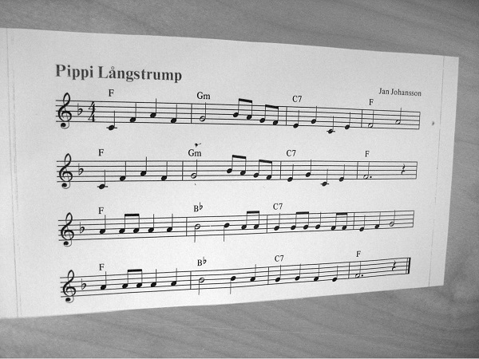
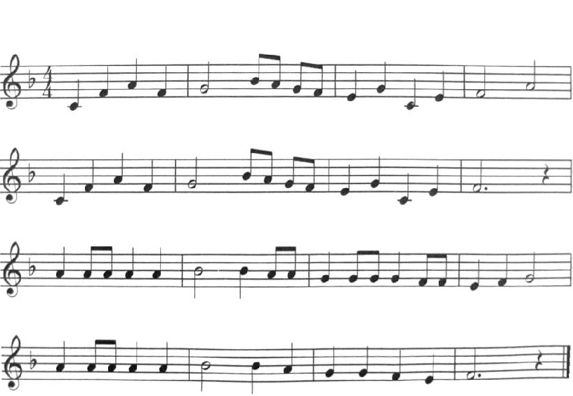
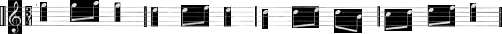
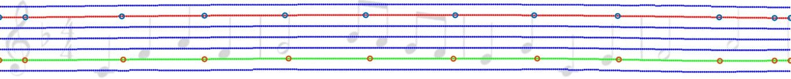
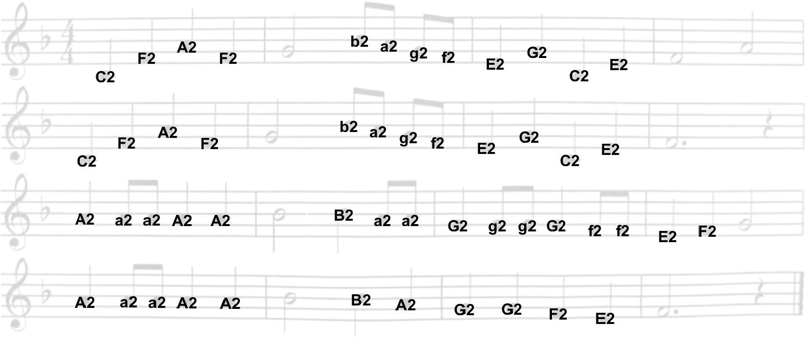

# TNM034-OMR
**Authors: Elias Elmquist, Denny Lindberg, Thobias Joelsson**

Optical Music Recognition project for the course TNM034 where black quarter and quaver notes are detected. Supply an image in double format to the tnm034 function and a text string will be returned for the detected notes.

## Features
 - Supports both photographs and scans.

 - Perspective/Rotation detection and inverse transformation.
 - Background removal / print extraction.
 - Clutter removal.

 - Segmentation of staffs.
 - Detection of symbol regions.

 - Coordinate system detection for curved staff lines.

 - Pitch detection for filled notes using a combination of template matching and shape detection based on symbol regions.

